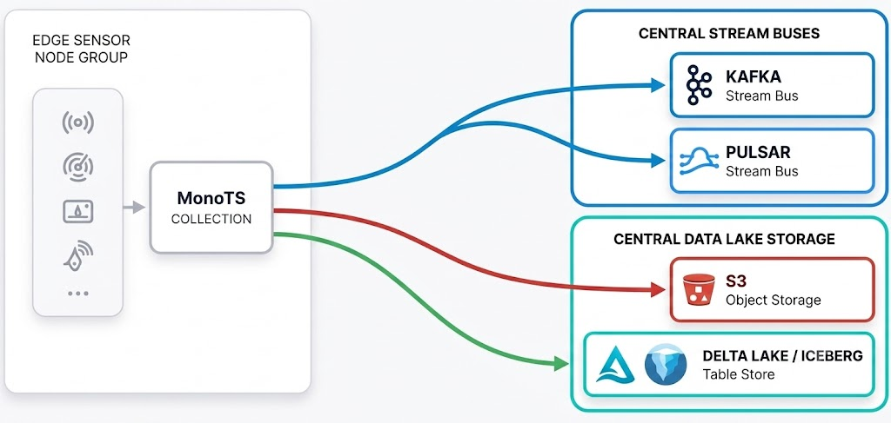

# MonoTS

A high-performance, edge-native time-series database built with Rust, Apache Arrow, and DataFusion.

MonoTS is engineered for environments where resources are constrained but data velocity is high. It combines the blazing-fast analytics of DataFusion with a purpose-built LSM-tree storage engine that flushes directly to Parquet. Whether you are collecting sensor telemetry on an edge gateway or routing micro-batches to a cloud data lake, MonoTS gives you a unified SQL interface to ingest, query, and stream your data.



## Why MonoTS?

**Bulletproof at the Edge** — Designed for constrained environments. MonoTS operates within strict, user-defined memory budgets. It proactively flushes memtables to disk before thresholds are breached, guaranteeing stable, long-running operation on edge devices without unpredictable OOM crashes.

**Built-in Data Streaming** — Bridge the gap between edge collection and cloud analytics. Instead of building separate CDC pipelines, you can use a single SQL statement to continuously push local data to Kafka, Delta Lake, or object storage with robust at-least-once guarantees.

**Zero-Overhead Analytics** — Optimized from ingestion to query. By leveraging Apache Arrow for zero-copy network transport and Parquet for time-ordered disk storage, MonoTS minimizes CPU usage during high-speed writes while delivering lightning-fast historical queries.

**Standard SQL & Flexible Schemas** — No proprietary query languages to learn. Powered by DataFusion, MonoTS uses standard SQL for everything from data analysis to live schema evolution. As your sensor payloads change, you can add new columns on the fly with zero downtime.

## Zero to Query in 60 Seconds

### 1. Build and Run

MonoTS compiles into a single, self-contained binary.

```bash
# Clone and build
make build-host

# Start the server (runs on 127.0.0.1:50051 by default)
make run-server
```

Or run with Docker:

```bash
# Build image and start via Compose (http://127.0.0.1:50051)
make docker-up

# Or: docker build -t monots:latest . && docker compose up -d
```

### 2. Connect and Query

Open a new terminal and launch the interactive CLI:

```bash
make run-cli
```

Once inside the REPL:

```sql
-- 1. Create a table (The 'time' column is mandatory for all tables)
CREATE TABLE metrics (
  time BIGINT,
  value DOUBLE
);

-- 2. Ingest some data
INSERT INTO metrics (time, value) VALUES (1000, 1.0), (2000, 2.5);

-- 3. Run fast, time-pruned analytical queries
SELECT * FROM metrics WHERE time >= 1000 ORDER BY time;

-- 4. Evolve your schema on the fly
ALTER TABLE metrics ADD COLUMN sensor_id VARCHAR;
```

### 3. Stream to the Lake

Push real-time changes to a local directory or a cloud data lake (S3/MinIO) using Delta Lake format:

```sql
CREATE STREAM metrics_to_lake WITH (
  'sink.type' = 'delta',
  'sink.delta.path' = '/tmp/monots-lake/metrics',
  'source.table' = 'metrics'
);

SHOW STREAM STATUS FOR metrics_to_lake;
```

## Documentation

| Guide                              | Contents                                                         |
|------------------------------------|------------------------------------------------------------------|
| **[Usage Guide](docs/usage.md)**   | Configuration, server administration, and Rust SDK integration   |
| **[SQL Reference](docs/sql.md)**   | Supported data types, DDL, and querying mechanics                |
| **[CDC Streams](docs/streams.md)** | Configuring Delta Lake, Kafka, and Filesystem delivery pipelines |

## License

MonoTS is open-source software licensed under the [Apache License, Version 2.0](LICENSE).

See the [NOTICE](NOTICE) file for copyright attribution.

All source files enforce a short Apache header. Build targets validate this via `make check-license`.
